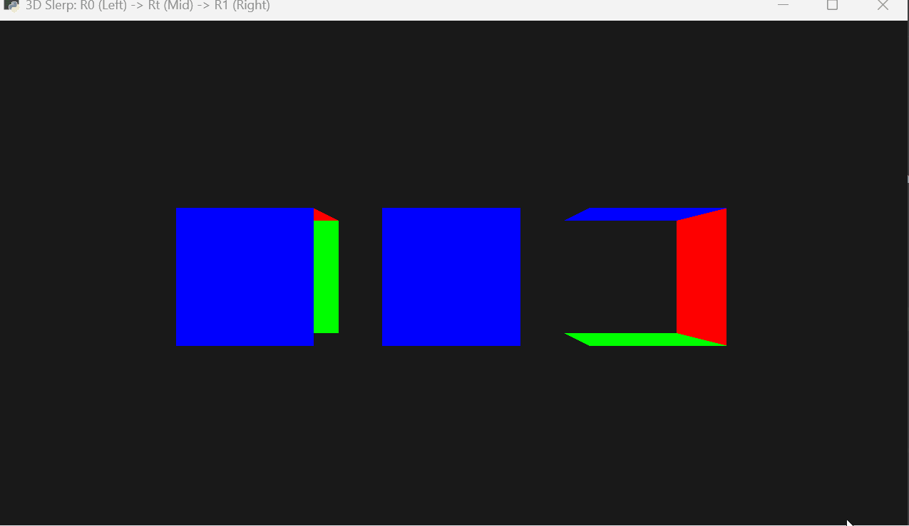

# 作业 2026.3.19

本项目基于 Taichi 语言实现了基础图形学渲染管线，涵盖从 2D 三角形到 3D 透视立方体的变换逻辑。

## 功能说明

### 1. 基础部分 (main.py)


* 实现了 MVP（Model-View-Projection）矩阵变换。
* 支持通过矩阵运算进行顶点坐标变换。
* 渲染内容为基础 2D 三角形。

### 2. 选作部分 (extension.py)


* 构建了 8 顶点、12 边的 3D 立方体线框模型。
* 引入了透视投影矩阵，实现近大远小的视觉效果。
* 支持绕 Y 轴的 3D 旋转展示。

### 3. 旋转插值进阶 (260326.py) [3.26 更新]


* 姿态平滑过渡：实现了从初始姿态 R0 到目标姿态 R1 的动态变换。
* Slerp 技术：采用四元数球面线性插值 (Spherical Linear Interpolation)，确保旋转路径最短且角速度恒定。
* 多维度对比：同屏展示了起始态、目标态及中间插值态 (Rt) 的对比。

---

## 运行方式

### 环境准备
确保系统已配置 Taichi 运行环境。
3.26 任务额外依赖：
```bash
uv pip install moderngl-window pyrr numpy
```

### 执行指令

**运行基础三角形：**
```bash
uv run main.py
```

**运行 3D 立方体：**
```bash
uv run extension.py
```

**运行 Slerp 姿态插值 (3.26 任务)：**
```bash
uv run src/work0/260326.py
```

# 备注
## 1. 本项目所有坐标变换逻辑均在 Taichi kernel 或着色器中并行实现。
## 2. 演示动图展示了立方体在透视投影下的旋转及插值效果。