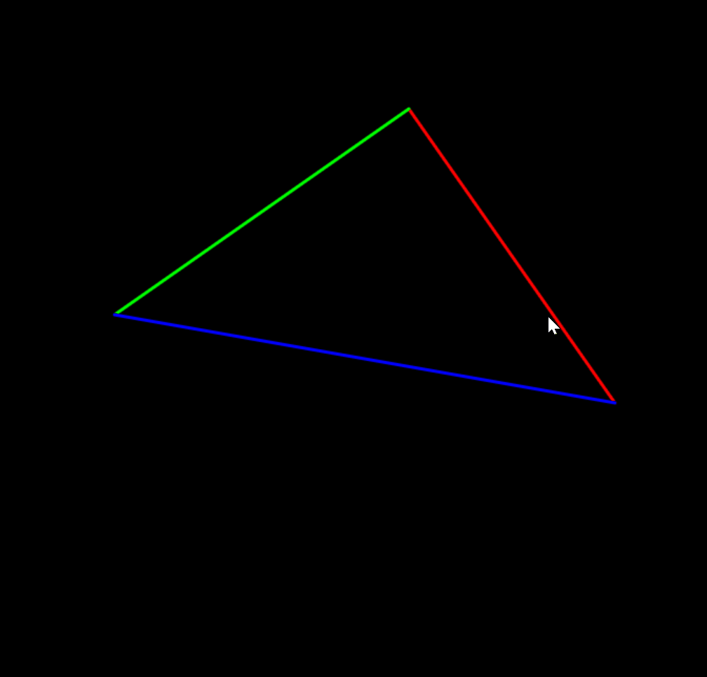
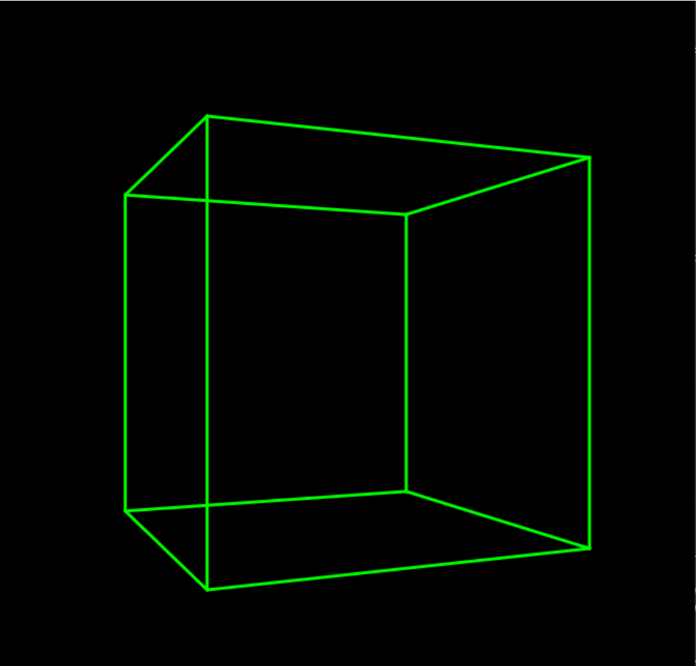

# 作业2026.3.19

本项目基于 Taichi 语言实现了基础图形学渲染管线，涵盖从 2D 三角形到 3D 透视立方体的变换逻辑。

## 功能说明

### 1. 基础部分 (main.py)


* 实现了 MVP（Model-View-Projection）矩阵变换。
* 支持通过矩阵运算进行顶点坐标变换。
* 渲染内容为基础 2D 三角形。

### 2. 选作部分 (extension.py)


* 构建了 8 顶点、12 边的 3D 立方体线框模型。
* 引入了透视投影矩阵，实现近大远小的视觉效果。
* 支持绕 Y 轴的 3D 旋转展示。

---

## 运行方式

### 环境准备
确保系统已配置 Taichi 运行环境。

### 执行指令

**运行基础三角形：**
```powershell
uv run main.py
```

**运行 3D 立方体：**
```powershell
uv run extension.py
```
# 备注
## 1. 本项目所有坐标变换逻辑均在 Taichi kernel 中并行实现。
## 2. 演示动图展示了立方体在透视投影下的旋转效果。